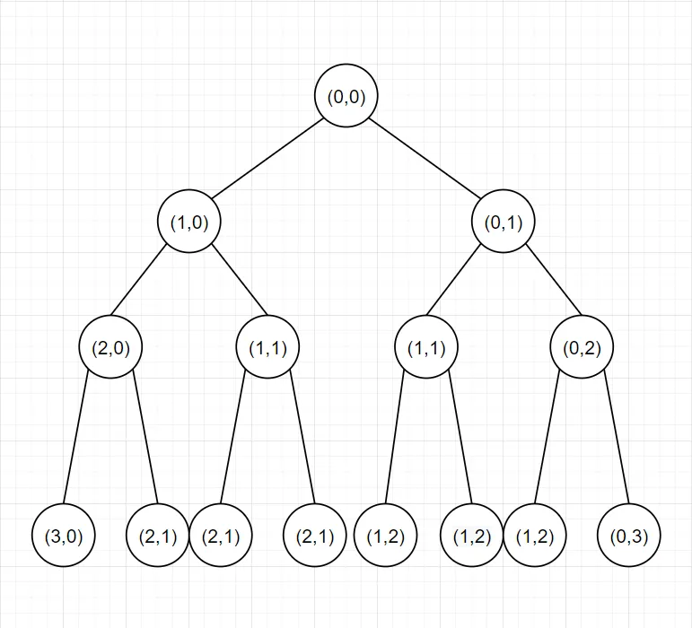
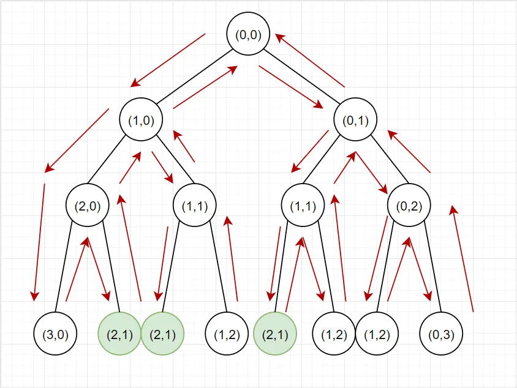
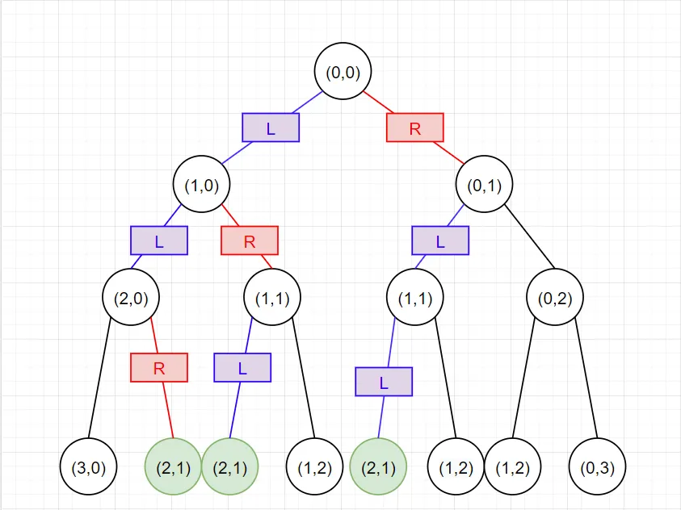
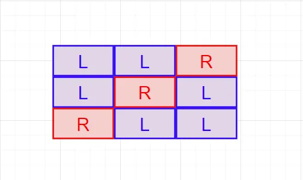

A few days ago I bumped into a question on [LeetCode](https://leetcode.com/) where I saw a bunch of people scratching their heads. It was question number 10 titled Regular Expression Matching with the difficulty label Hard. The solution to the exercise itself was not intuitive, requiring effective use of previously solved subproblems, but that wasn’t what everyone in the comments were interested in. After all the solution was available for everyone to see.

The real intrigue was the calculated but unexplained time complexity for one of the inefficient solutions which only used recursion, minus the dynamic programming. After all, [dynamic programming](https://en.wikipedia.org/wiki/Dynamic_programming) makes time and space complexity fairly easy to compute, as long as the solution is correct, it cannot exceed the complexity of all possible subproblems. Before I can get ahead of myself though here’s the outline of the original problem which can also be found here https://leetcode.com/problems/regular-expression-matching/

If at some point I lose you during the explanation please leave a comment so I can make a revision.

### The Problem:

Given an input string (`s`) and a pattern (`p`), implement regular expression matching with support for `'.'` and `'*'`.

```markdown
'.' Matches any single character.
'*' Matches zero or more of the preceding element.
```

The matching should cover the **entire** input string (not partial).

Note:

- `s` could be empty and contains only lowercase letters `a-z`.
- `p` could be empty and contains only lowercase letters `a-z`, and characters like `.` or `*`.

### Some Examples:
#### Example 1

```
Input:
s = "abcda"
p = "ab.d"
Output: false
Explanation: The . matches the c but the pattern ends before matching to the entire text.
```

#### Example 2

```
Input:
s = "aab"
p = "c*a*b"
Output: true
Explanation: c can be repeated 0 times, a can be repeated 2 times. Therefore, it matches "aab".
```

#### Example 3

```
Input:
s = "ab"
p = ".*"
Output: true
Explanation: ".*" means "zero or more (*) of any character (.)".
```

The examples above summarize the kind of cases you can expect to be dealing with during testing. Because the title of the article is “Solving for Recursive Complexity” and not “How to Solve Recursive Problems” I won’t be going too deeply into how to solve this kind of problem. Instead I will resort to flashing a piece of pseudo code that explains the 3 recursive gates that our algorithm will be passing through on its journey to the end of the piece of text. I’d recommend trying to solve this problem on your own by going to the link I included above, and coming back here once you’ve gained a level of appreciation for this problem, because I’m about to spoil it for you.

### Solution Pseudo-code:


### Quick Explanation

If you’re not very familiar with recursion, this code block might still look very intimidating. The gist is that we’re only doing two things: 

1) checking if the current character of the text matches the pattern and 

2) asking if the pattern will match the text if we modify the text a bit or the pattern a bit or both for the remaining characters.

**Line 12: `keep_asterisk_match` is true if we don’t change the pattern but move along the length of the text (**text[1:]**). This is how `*` is dealt with in recursion, we simply move on to the next character of the text like the current one never existed and keep the asterisk in the pattern.

**Line 17:** `skip_asterisk_match` is true if the text matches the pattern without the asterisk (**pattern[2:]**) i.e if we match 0 of the preceding element. Remember in Example 2 where c* didn’t have to match anything, and this is also how we jump out of the `keep_asterisk_match` trap that we made for ourselves earlier.

**Line 20**: Once we get an answer for whether we get a match when keeping or skipping the asterisk after `keep_asterisk_match` and `skip_asterisk_match` are run we return the result as shown in the OR table below.



**Line 24**: If we don’t see an asterisk we check if that first character matched the pattern with `character_match` and we keep recusing by reducing the input text and pattern by that first matched character (**text[1:], pattern[1:]**) and recursively check if the rest of the string matches.

**Line 4**: The final part of recursion which ironically is usually defined at the top of the function, is our recursion rock bottom. If we have an empty pattern and an empty string as our inputs, we have the divine knowledge that the pattern will match the string because empty matches empty for sure. If only one of them is empty we know that there’s no match.

### Considering the Complexity

The time complexity for this question appears to be difficult to pin down. After all, there are two points of recursion and one full stop. And like I said before, the answer to the complexity is given in the solutions with no further explanations. For text of length T and pattern of length P, with the text being indexed at text[i:] and pattern[2j:], the time complexity for this question is….**drum roll**

\[
  \sum_{i=0}^{T}\sum_{j=0}^{P/2}\binom{i+j}{i} \space O(T-i) +  \space  O(P-2j)
\]

Well, that’s quite something.

Normally you’d expect something like O(T*P) or anything else to that effect and in fact, the solutions do propose a more concise upper bound, again without any explanations (not surprisingly), but we’ll get to that later. For now we have enough on our hands as it is with this piece of work.

### Linear vs Exponential Complexity

The reason why the complexity isn’t as simple as it is for something like [bubble sort](https://en.wikipedia.org/wiki/Bubble_sort), is because we’re not making linear passes over our text and pattern. Instead we’re doing things recursively, diving deeper and deeper through sections of our text and pattern and revisiting the same sub problems for what can feel like an arbitrary number of times. The reason I bring up bubble sort, which has O(n²) complexity, is because its complexity decreases in the shape of a pyramid as we sort more and more digits.


On the other hand, recursion has the classic shape of a tree due to the multiple places where the function can call itself.


The structures look deceptively similar but the crucial difference is that where the pyramid decreases linearly, the tree grows exponentially. This creates a world of a difference when analyzing time and space complexity.

### Our Worst Case

When analyzing worst case complexity we have to think of the worst case input. Because we have two inputs, text and pattern, I will focus on the pattern because one depends on the other and at least for me it’s easier to think of the rules rather than the results. In this question each new character we add to our pattern can be either a `.*` or `.` where `.` can be any character. From the code it should be pretty clear which choice causes more computation. If we include the `*` character, our code splits into two streams which must both be computed until inevitably they should return whether there’s a match, meanwhile if we are matching a single character the fun stops pretty quickly as we are only taking a single route, linearly.


It looks pretty clear that a worst case pattern would consist of many .* to create as many diverging paths as possible, with a final text character which does or doesn’t match the pattern.

**Text: aaaaaaaaaab**

**Pattern: a\*a\*a\*a\*a\*a\*a\*a\*a\*a\***

In this scenario we must get both to the end of the pattern and to the end of the string to determine that there is no match, while branching 2¹⁰ number of times starting from the first index of the text.

### Visualizing the Computation

In order to figure out the time complexity we have to find how many times each sub-problem had to be computed. Because we are not saving the result like in dynamic programming this will largely contribute to the exploding runtime. Each sub-problem consists of answering whether text[i:] and pattern[2j:] are a match. We use pattern[2j:] because we are using `.*` repeatedly in our pattern for the worst case, every time we take the **skip_asterisk_matched** path we skip one of the `.*` which take up two spaces. In order to visualize the two branches of **skip_asterisk_matched** and **keep_asterisk_matched** we will draw a tree diagram to illustrate all the visited sub-problems. Each node will have the format (i,j) for where the text and pattern are indexed at each point in time.



A quick side note on this, when performing recursion, the algorithm will perform a [depth-first search](https://en.wikipedia.org/wiki/Depth-first_search) by taking the left path first on each iteration. This doesn’t make much of a difference though because in the worst case we’ll have to traverse the entire tree anyways. Let’s take an example sub-problem where we want to see if text[2:] and pattern[2:] were a match. This will appear as (2,1) on our tree:

i=2 because we are at text[2:] for the text
j=1 because we are at pattern[2:] which in the worst case means we have only a single `.*` asterisk that takes up two spaces. Following pattern[2j:] means j=1.



We can see that this sub-problem had been encountered 3 times during computation. The tree format is good for seeing when these sub-problems will be encountered but it’s not very good at determining how many times that will happen.

### Combinations

The way to systematically consider how many times a sub-problem will be encountered is to consider how come these sub-problems tend to repeat themselves in the first place. In order to arrive at (2,1) on our tree we have to take two lefts and one right.



As we can see this can happen in three ways, if we traverse the tree in the sequence LLR, LRL and RLL.



In the example of (2,1) we know that we will have 2+1=3 place holders where 2 of the placeholders will be an L and 1 will be an R. In order to find how many combinations are possible we can simply compute 3C2 where out of 3 place holders we will choose 2 to be an L and the rest will automatically be Rs.

That means that for sub-problem (i,j) we have i+j placeholders with i of those being the left side and j being on the right side. This is why the solutions include the combinations symbol for the number of encountered sub-problems (i,j) with (i+j choose i).

\[
  \binom{i+j}{i}
\]

Incidentally this is also equivalent to (i+j choose j) because it does not matter whether you are picking which i increments are on the left or instead picking which j increments are on the right, the number of distinct combinations will be the same.

\[
  \binom{i+j}{j}
\]

### Sub-Problem Complexity

Now that we know how many sub-problems of each kind we will encounter, we should figure out how long those individual sub-problem will take to complete. This sort of thing tends to be very easy to do with recursive problems, like in this case where we only really do one thing, compare a single character and store the result in character_match. This might lead you to believe that the runtime for each sub-problem is constant O(1), but in order to call the function we must first supply text[i] and pattern[j:] arguments. If the strings are long, this procedure is not trivial, especially in python where in order to pass in a sub-string a new string must be created. Therefore for each sub-problem there is a constant time O(1) for checking that the character matched, an O(T-i) for passing in the part of the string that we don’t know is a match yet, and an O(P-2j) for passing in the part of the pattern that we don’t know is a match yet. Adding everything together we arrive at the complexity given in the solution.

\[
  \sum_{i=0}^{T}\sum_{j=0}^{P/2}\binom{i+j}{i} \space O(T-i) +  \space  O(P-2j)
\]

### The Concise Solution

Remember earlier when I said that the solution proposed a more general bound, without the complex combination notation and sigma signs.

Well here it is.

\[
  O((T+P) * 2^{T+\frac{P}{2}})
\]

Let’s go through the idea behind this one before we wrap up.

The idea behind making the time complexity into this simplified form is to go overkill on both how many sub problems we could encounter and how long we plan on those sub problems taking to compute.

#### Number of Sub-problems

Instead of using combinations to compute precisely how many sub problems we will encounter, which based on our combinations calculation will be only a portion of our tree’s leaf nodes, let’s just take the entire bottom level of the tree. 

Let’s also make the tree completely full with a depth of the maximum number that \(i+j\) can take, which is \((T+\frac{P}{2})\).

- T for the length of the text and \(\frac{P}{2}\) for all `.*` instances in our worst case pattern

- A tree of depth \((T+\frac{P}{2})\) will have \(2^{(T+\frac{P}{2})}\) nodes at the lowest level.


In the image we can see the previous example of text[2:] and pattern[2:] being computed \(\binom{2+1}{2}\) = 3 times, but since we know that all these examples happen on the same level (because # of Ls+ # of Rs is always 3) we can compute the number of all sub problems on that level which is \(2^{(2+\frac{2}{2})}\) = 2³ = 8.

The number of nodes on the entire level (8 in this case) will always be larger than the \(\binom{i+j}{j}\) nodes (3 in this case), so we can use this calculation in our more general upper bound. So we have determined that our upper bound will assume that we will go through \(2^{(T+\frac{P}{2})}\) subproblems, even though we really never will, but it does make our formula more concise.

#### Sub-problem Complexity

Instead of computing how large the arguments will be before we pass them in, let’s just assume we are passing in the entire strings for both the text and pattern. This will give us **O(T+P)** time complexity for each sub-problem, eliminating the need to compute what O(T-i) and O(P-2j) are at every step.

#### Final Answer

Multiplying the Sub-problem complexity by the number of sub-problems gives us the final answer of:

\[
  O((T+P) * 2^{T+\frac{P}{2}})
\]

### A Case for Dynamic Programming

This was all incredibly tedious and time consuming on both ours and the computer’s part. At some point you probably thought that computing the same problem (i+j choose i ) times was a bit wasteful and if we just stored that result it would save us a lot of trouble. You’d be right.

There’s only T*P distinct combinations of (i,j), and each takes only constant time to verify, so simply storing all of them in a grid will bump our computation down to a whopping.

\[
  O(TP)
\]

I hope you enjoyed this exercise in computational complexity. Seeing as you got to the very end, do give yourself a pat on the back because you deserve it.
