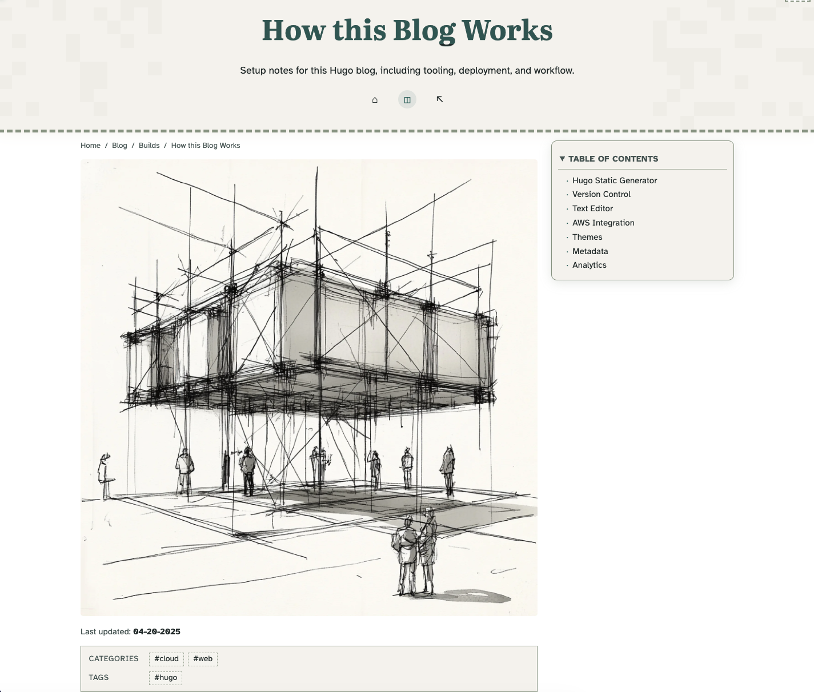

# Muratov Theme



This is a separate custom Hugo theme used for [michaelmuratov.com](https://michaelmuratov.com).

It is based on [Hugo Simple](https://github.com/maolonglong/hugo-simple) Theme, which itself builds on:
- [Simple.css](https://simplecss.org/)
- [Bear Blog](https://bearblog.dev)

## Status

This theme has diverged significantly from upstream Hugo Simple and is maintained as a project-specific theme.

## Key Customizations

- Custom homepage layout and section system
- Track-based blog hub cards (Builds, Guides, Notes, Series)
- Reusable homepage status and momentum components
- Header corner activity grid visuals
- Giscus article comments integration
- Expanded article/list UI styling and taxonomy presentation

## Usage

In `hugo.toml`:

```toml
theme = "muratov"
```

Theme source lives in:

```text
themes/muratov/
```

## Attribution

Upstream base:
- [maolonglong/hugo-simple](https://github.com/maolonglong/hugo-simple)

Foundational design/themes:
- [HermanMartinus/bearblog](https://github.com/HermanMartinus/bearblog)
- [kevquirk/simple.css](https://github.com/kevquirk/simple.css)
- [janraasch/hugo-bearblog](https://github.com/janraasch/hugo-bearblog)
- [clente/hugo-bearcub](https://github.com/clente/hugo-bearcub)
